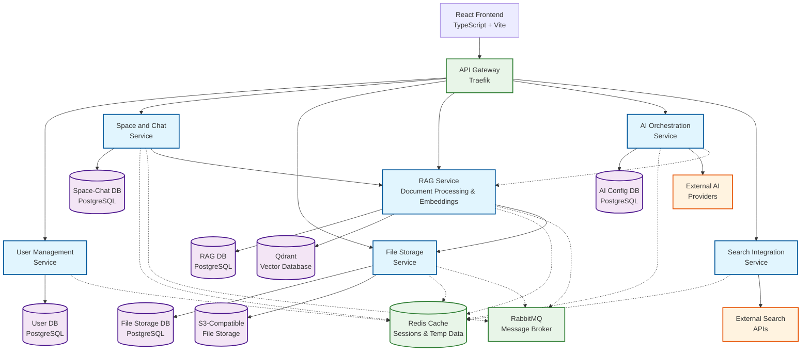
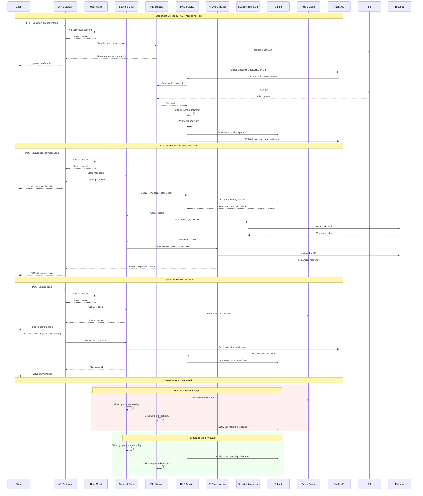

# Technical Architecture: Jeex AI Chat Platform

## System Overview

Jeex is architected as a distributed microservice system designed for high availability, scalability, and extensibility. The architecture prioritizes clear service boundaries, data isolation, and pluggable components to support the platform's core features: collaborative AI conversations, shared workspaces with RAG-powered document intelligence, and multi-provider AI model support.

### Architectural Principles

- **Service Autonomy**: Each microservice owns its data and domain logic completely
- **API-First Communication**: All inter-service communication occurs through well-defined APIs
- **Data Isolation**: Strict per-user and per-Space data boundaries enforced at multiple layers
- **Pluggable Components**: Key integrations (AI providers, search engines) designed for easy replacement
- **Event-Driven Updates**: Asynchronous processing for non-critical operations and cross-service updates
- **Stateless Services**: All services designed to scale horizontally without session affinity

## Component Overview

### Core Services

#### API Gateway Service
**Primary Interface Layer - Critical Service**

The API Gateway serves as the single entry point for all client communications and bears primary responsibility for request routing, authentication validation, rate limiting, and protocol translation.

**Responsibilities:**
- Request routing and load balancing to backend services
- JWT token validation and user context injection
- Rate limiting and DDoS protection
- Protocol translation (HTTP to internal service protocols)
- Real-time streaming coordination via Server-Sent Events
- API versioning and backward compatibility management

**High-Level API Surface:**
- `POST /api/auth/*` - Authentication endpoints
- `GET|POST|PUT|DELETE /api/spaces/*` - Space management
- `GET|POST|PUT|DELETE /api/chats/*` - Chat operations
- `POST /api/chats/{id}/messages` - Message sending
- `GET /api/chats/{id}/stream` - SSE message streaming
- `POST /api/documents/*` - Document upload and management
- `GET /api/search/*` - Web search integration
- `GET /api/models` - Available AI models and providers

**Failure and Isolation Modes:**
- Circuit breakers for each downstream service with configurable thresholds
- Graceful degradation: read-only mode when write services are unavailable
- Request queuing and backpressure handling for overloaded services
- Health check aggregation and service discovery integration

**Upgrade and Replacement Considerations:**
- Blue-green deployment support with traffic splitting
- API versioning strategy supporting concurrent version operation
- Configuration-driven service endpoint management
- Stateless design enabling zero-downtime rolling updates

#### User Management Service
**Responsibilities:**
- User authentication and session management
- User profile and preferences storage
- Future: tenant management, roles, and permissions
- Password hashing, token generation, and security policy enforcement

**Data Ownership:**
- User accounts, profiles, and authentication credentials
- Session tokens and refresh token management
- User preferences and application settings

#### Space and Chat Service
**Responsibilities:**
- Workspace creation, modification, and deletion
- Space membership and access control
- Space metadata and configuration management
- Conversation lifecycle management (create, update, delete, archive)
- Message history storage and retrieval
- Chat metadata and configuration (model selection, system prompts)
- Chat-to-Space relationship management
- Message threading and conversation context management
- Document association and visibility rules

**Data Ownership:**
- Space definitions, metadata, and configurations
- Space membership records and access permissions
- Chat-Space associations and visibility mappings
- Chat conversations and message history
- Chat metadata (titles, creation dates, model selections)
- Message threading and conversation structure

#### AI Orchestration Service
**Responsibilities:**
- AI provider abstraction and model management
- Request routing to appropriate AI services based on model selection
- Response streaming and format normalization
- Context injection from RAG and search results
- Token usage tracking and quota management

**Data Ownership:**
- AI provider configurations and API keys
- Model availability and capability definitions
- Usage metrics and token consumption logs

#### File Storage Service
**Responsibilities:**
- Secure file storage and retrieval (S3-compatible interface)
- File access control and permissions management
- File versioning and metadata management
- Storage quota management and monitoring
- Presigned URL generation for secure file access

**Data Ownership:**
- Original uploaded files (documents, images, etc.)
- File metadata and access permissions
- File versioning history
- Storage usage metrics

#### RAG Service
**Responsibilities:**
- File upload handling and validation
- Document parsing (Markdown, PDF) and text extraction
- Vector embedding generation and storage
- Semantic search and similarity matching
- Context retrieval based on query relevance
- Space-specific index management and isolation
- Embedding model management and updates
- Document metadata extraction and storage
- Integration with File Storage Service for content retrieval

**Data Ownership:**
- Vector embeddings and semantic indices
- Space-specific RAG contexts and boundaries
- Query-response relevance mappings
- Embedding model configurations
- Document parsing results and extracted content
- Document metadata and references

#### Search Integration Service
**Responsibilities:**
- External search API coordination and management
- Search result processing and normalization
- Search provider abstraction and pluggable backends
- Search result caching and rate limit management

**Data Ownership:**
- Search provider configurations and API credentials
- Cached search results (temporary, with TTL)
- Search query logs and analytics

### Data Layer

#### PostgreSQL Clusters (Per-Service)
Each service maintains its own PostgreSQL database instance to ensure service autonomy and data isolation:

- **User DB**: Authentication, profiles, sessions, preferences
- **Space-Chat DB**: Workspace definitions, memberships, conversations, messages, chat metadata
- **File Storage DB**: File metadata, access permissions, storage references
- **RAG DB**: Document parsing results, embedding metadata, vector indices
- **AI Config DB**: Model definitions, provider settings, usage logs

#### Redis Cache Cluster
Shared caching layer for cross-service data and session management:
- User session tokens and authentication state
- Frequently accessed chat message previews
- Model availability and configuration cache
- Rate limiting counters and quota tracking
- Temporary data for real-time streaming operations

#### RabbitMQ Message Broker
Asynchronous event processing and service coordination:
- Document processing pipeline events
- RAG index update notifications
- Space membership change propagations
- Usage metric collection and aggregation
- Audit log generation and distribution

#### Qdrant Vector Database
Dedicated vector storage for RAG functionality:
- Document embedding storage with Space-based partitioning
- Semantic search index management
- User and Space access control integration
- High-performance similarity search operations

## Data Flow and Access Control

### RAG Data Flow

1. **Document Upload**: Client uploads document to API Gateway
2. **File Storage**: File Storage Service securely stores the uploaded file
3. **Processing Pipeline**: RAG Service retrieves file from storage and processes content
4. **Embedding Generation**: RAG Service generates embeddings from extracted content
5. **Index Storage**: Embeddings stored in Qdrant with Space-specific partitioning
6. **Query Processing**: Chat messages trigger RAG queries against relevant Space context
7. **Context Injection**: Retrieved context injected into AI model requests

### Access Control Enforcement

**Per-User Isolation:**
- Database-level row-level security policies
- Service-level user context validation
- API Gateway user token verification
- Vector database user-based filtering

**Per-Space Visibility:**
- RAG Service enforces Space-based context boundaries
- File Storage Service validates Space membership before file access
- Space and Chat Service restricts message visibility to Space members
- Vector queries filtered by Space membership

### Data Ownership Matrix

| Service | Primary Data | Dependent Data | External Integrations |
|---------|-------------|----------------|----------------------|
| User Management | User accounts, sessions | N/A | Future: SSO providers |
| Space and Chat | Space definitions, conversations | User memberships, file references | AI models via orchestration |
| File Storage | File content, metadata | Access permissions | N/A |
| RAG Service | Vector embeddings, parsed content | Document references | Embedding models |
| AI Orchestration | Model configs | Usage metrics | External AI APIs |
| Search Integration | Search configs | Query cache | External search APIs |

## Non-Functional Requirements

### Scalability Requirements
- **Horizontal Scaling**: All services designed for stateless horizontal scaling
- **Database Sharding**: PostgreSQL databases support read replicas and horizontal partitioning
- **Vector Search Performance**: Qdrant configured for high-throughput similarity searches
- **Message Throughput**: System capable of handling 1000+ concurrent conversations
- **Document Processing**: Asynchronous pipeline supporting large file uploads (up to 100MB)

### Availability Requirements
- **Service Level**: 99.9% uptime for core chat functionality
- **Graceful Degradation**: System remains functional with individual service outages
- **Data Durability**: All persistent data replicated with automated backup procedures
- **Recovery Time**: Maximum 4-hour RTO for complete system restoration

### Performance Requirements
- **Response Latency**: API responses under 200ms for cached operations
- **Streaming Latency**: AI response streaming with under 500ms first-token latency
- **Search Performance**: RAG queries completed within 1-2 seconds
- **Concurrent Users**: Support for 10,000+ concurrent active users

### Security Requirements
- **Data Encryption**: All data encrypted at rest and in transit
- **API Security**: JWT-based authentication with configurable token expiration
- **Network Isolation**: Service-to-service communication over encrypted internal networks
- **Audit Logging**: Comprehensive audit trails for all data access and modifications
- **Vulnerability Management**: Regular security scanning and dependency updates

## Deployment Architecture

```mermaid
graph TB
    subgraph "External Network"
        Internet[Internet]
        AIProviders[AI Providers<br/>OpenAI, Anthropic, etc.]
        SearchAPIs[Search APIs<br/>Tavily, Serper, etc.]
    end
    
    subgraph "DMZ Network"
        LB[Load Balancer<br/>Traefik]
    end
    
    subgraph "Application Network"
        subgraph "Service Containers"
            GW[API Gateway<br/>Container<br/>:3000]
            USER[User Management<br/>Container<br/>:3001]
            SPACE[Space & Chat<br/>Container<br/>:3002]
            FILE[File Storage<br/>Container<br/>:3003]
            RAG[RAG Service<br/>Container<br/>:3004]
            AI[AI Orchestration<br/>Container<br/>:3005]
            SEARCH[Search Integration<br/>Container<br/>:3006]
        end
        
        subgraph "Configuration"
            ENV[.env File<br/>Mounted Volume]
        end
    end
    
    subgraph "Data Network"
        subgraph "Database Containers"
            USERDB[(User DB<br/>PostgreSQL<br/>:5432)]
            SPACEDB[(Space-Chat DB<br/>PostgreSQL<br/>:5433)]
            FILEDB[(File Storage DB<br/>PostgreSQL<br/>:5434)]
            RAGDB[(RAG DB<br/>PostgreSQL<br/>:5435)]
            CONFIGDB[(AI Config DB<br/>PostgreSQL<br/>:5436)]
        end
        
        subgraph "Infrastructure Containers"
            REDIS[(Redis Cache<br/>:6379)]
            RABBIT[RabbitMQ<br/>:5672, :15672]
            QDRANT[(Qdrant Vector DB<br/>:6333)]
            S3[MinIO S3 Storage<br/>:9000, :9001]
        end
    end
    
    subgraph "Monitoring Network"
        HEALTH[Health Checks]
        LOGS[Log Aggregation]
        METRICS[Metrics Collection]
    end
    
    %% External Connections
    Internet --> LB
    LB --> GW
    
    %% Service to Service Communication
    GW --> USER
    GW --> SPACE
    GW --> FILE
    GW --> RAG
    GW --> AI
    GW --> SEARCH
    
    %% Service to Database Connections
    USER --> USERDB
    SPACE --> SPACEDB
    FILE --> FILEDB
    RAG --> RAGDB
    AI --> CONFIGDB
    
    %% Shared Infrastructure Connections
    USER -.-> REDIS
    SPACE -.-> REDIS
    FILE -.-> REDIS
    RAG -.-> REDIS
    AI -.-> REDIS
    SEARCH -.-> REDIS
    
    RAG -.-> RABBIT
    SPACE -.-> RABBIT
    FILE -.-> RABBIT
    
    RAG --> QDRANT
    FILE --> S3
    RAG -.-> FILE
    
    %% Configuration
    ENV -.-> GW
    ENV -.-> USER
    ENV -.-> SPACE
    ENV -.-> FILE
    ENV -.-> RAG
    ENV -.-> AI
    ENV -.-> SEARCH
    
    %% External API Connections
    AI -.-> AIProviders
    SEARCH -.-> SearchAPIs
    
    %% Monitoring Connections
    HEALTH -.-> GW
    HEALTH -.-> USER
    HEALTH -.-> SPACE
    HEALTH -.-> FILE
    HEALTH -.-> RAG
    HEALTH -.-> AI
    HEALTH -.-> SEARCH
    
    LOGS -.-> GW
    LOGS -.-> USER
    LOGS -.-> SPACE
    LOGS -.-> FILE
    LOGS -.-> RAG
    LOGS -.-> AI
    LOGS -.-> SEARCH
    
    %% Network Security Zones
    classDef external fill:#ffebee,stroke:#c62828,stroke-width:2px
    classDef dmz fill:#fff3e0,stroke:#ef6c00,stroke-width:2px
    classDef application fill:#e8f5e8,stroke:#2e7d32,stroke-width:2px
    classDef data fill:#e3f2fd,stroke:#1565c0,stroke-width:2px
    classDef monitoring fill:#f3e5f5,stroke:#7b1fa2,stroke-width:2px
    classDef config fill:#fffde7,stroke:#f57f17,stroke-width:2px
    
    class Internet,AIProviders,SearchAPIs external
    class LB dmz
    class GW,USER,SPACE,FILE,RAG,AI,SEARCH application
    class USERDB,SPACEDB,FILEDB,RAGDB,CONFIGDB,REDIS,RABBIT,QDRANT,S3 data
    class HEALTH,LOGS,METRICS monitoring
    class ENV config
```

### Containerization Strategy
- **Service Containers**: Each microservice packaged as minimal Docker container
- **Database Containers**: PostgreSQL, Redis, RabbitMQ, and Qdrant as managed containers
- **File Storage**: S3-compatible storage backend (MinIO or cloud S3)
- **Shared Configuration**: Single `.env` file mounted across all service containers
- **Health Checks**: Container-level health monitoring and automatic restart policies

### Environment Configuration
- **Single Source**: Centralized `.env` file for all environment-specific settings
- **Secret Management**: Sensitive values managed through container secret mechanisms
- **Feature Flags**: Configuration-driven feature enabling/disabling across environments
- **Runtime Reconfiguration**: Key settings modifiable without service restarts

### Network Architecture
- **API Gateway**: Single external-facing endpoint (Traefik-based)
- **Internal Mesh**: Service-to-service communication over internal network
- **Database Network**: Isolated network segment for data layer components
- **Monitoring Network**: Separate network for observability and health checking

## Real-Time Communication Architecture

The platform uses **Server-Sent Events (SSE)** as the primary real-time communication mechanism. This approach provides:

- **Simple Implementation**: HTTP-based streaming with native browser support
- **Firewall Friendly**: Works through standard HTTP infrastructure
- **Unidirectional Streaming**: Perfect for AI response streaming and status updates
- **Connection Management**: Built-in reconnection and error handling
- **Scalability**: Stateless design supporting horizontal scaling

**Implementation Details:**
- AI response streaming via `/api/chats/{id}/stream` endpoint
- Real-time status updates for document processing
- Space and chat updates pushed to connected clients
- Automatic reconnection handling in client applications
- Connection pooling and resource management in API Gateway

## Migration and Upgrade Strategies

### Service Replacement Framework
- **Interface Contracts**: Well-defined APIs enabling service-by-service replacement
- **Feature Flags**: Gradual rollout of new service implementations
- **Data Migration Tools**: Automated migration utilities for service data transitions
- **Rollback Procedures**: Reliable rollback mechanisms for failed upgrades

### Database Evolution
- **Schema Versioning**: Database migration scripts with version control integration
- **Zero-Downtime Upgrades**: Blue-green database deployment strategies
- **Data Consistency**: Cross-service data consistency verification during upgrades
- **Backup Integration**: Automated backup creation before major migrations

### Configuration Management
- **Backward Compatibility**: Configuration format evolution with legacy support
- **Environment Promotion**: Consistent configuration deployment across environments
- **Secret Rotation**: Automated credential rotation procedures
- **Feature Lifecycle**: Systematic feature deprecation and removal processes

## Acceptance Criteria

### Service Isolation Verification
- Each service operates independently with its own data store
- Service failures do not cascade to other system components
- Data access strictly enforced through service APIs only
- Service replacement possible without affecting other components

### Performance Benchmarks
- API response times meet specified latency requirements
- Concurrent user load testing validates scalability targets
- RAG query performance meets search responsiveness requirements
- Streaming latency satisfies real-time interaction expectations

### Security Validation
- Per-user data isolation verified through penetration testing
- Space-based access controls validated through comprehensive testing
- API security measures tested against common attack vectors
- Audit logging completeness verified across all data operations

### Operational Readiness
- All services demonstrate reliable containerized deployment
- Health monitoring and alerting cover all critical system components
- Backup and recovery procedures validated through disaster simulation
- Configuration management enables consistent environment promotion

## Extensibility Considerations

### Future Enhancement Points
- **Identity Integration**: OAuth/SAML provider integration points identified
- **API Expansion**: Public API framework for third-party integrations
- **Advanced Search**: Plugin architecture for custom search provider integration
- **Collaboration Features**: Real-time collaboration infrastructure preparation
- **Analytics Platform**: Data pipeline foundation for usage analytics and insights

### Technology Evolution
- **Container Orchestration**: Kubernetes migration pathway defined
- **Service Mesh**: Istio/Envoy integration for advanced traffic management
- **Observability**: OpenTelemetry integration for comprehensive system monitoring
- **Edge Computing**: CDN integration for global content delivery optimization